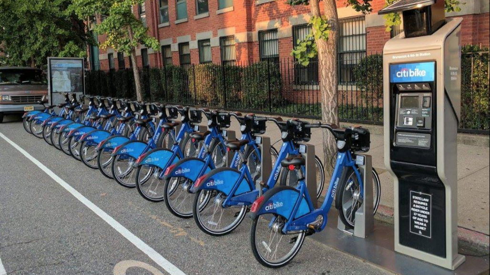
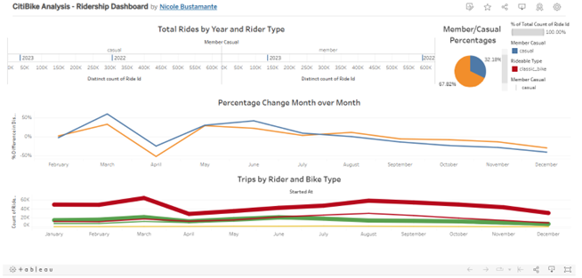
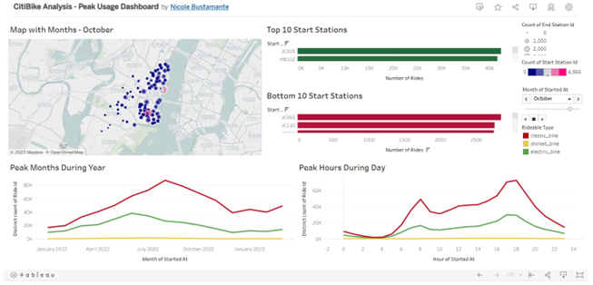

# CitiBike Trip Data Analysis

## Tableau Story
<a href = "https://public.tableau.com/app/profile/nicole.bustamante/viz/CitiBikeTripDataTableauStory/Story1?publish=yes"> CitiBike Trip Data Tableau Story</a>
 

## Background
CitiBike is one of the largest bike-sharing programs in the United States and includes New York City, NY; Jersey City, NJ; and Hoboken, NJ. Since 2013, CitiBike has implemented a robust infrastructure for collecting operational data on the program's usage. Each month, bike data is collected, organized, and made public on the CitiBike DataLinks website.

City officials would like an update on the overall utilization of the program, focusing on Jersey City, NJ data.  The following dashboards and visualizations will provide a narrative to inform city officials on key trends and metrics, which can then be used to make informed decisions on the program moving forward.

## Analyses, Summaries, and Opportunities
Monthly CitiBike trip data for Jersey City, NJ, from January 2022 to March 2023 is included in the dataset. Many relevant data points and visualizations were created; but for purposes of this endeavor, the analysis focused on the following two phenomena:

### <b>Phenomena #1:</b> <u>Ridership Trends</u> - the bullets below contain a link to the Tableau dashboard, details/summary on the visualizations, opportunities, and a static image of the dashboard.

<li><a href = "https://public.tableau.com/app/profile/nicole.bustamante/viz/CitiBikeAnalysis-RidershipDashboard/RidershipDashboard?publish=yes"> Ridership Dashboard </a></li>

<li>Visual #1: "Total Rides by Year and Rider Type"</ul>
<ul> - Table is segmented into 2 portions, Member and Casual (non-member)</ul>
<ul> - Hover over each year and the total numbers of rides by rider type will pop up</ul>

<li>Visual #2: "Member/Casual Percentages"
<ul> - Pie chart shows the breakdown percentages by rider type</ul>
<ul> - Members account for 67.82% of total rides during the time period</ul>
<ul> - Casual accounts for 32.18% of total rides during the time period</ul>

<li>Visual #3: "Percentage Change Month over Month"
<ul> - Line graph shows the percentage change in rides by rider type</ul>
<ul> - Members outpace non-members during the first half of the year</ul>

<li>Visual #4: "Trips by Rider and Bike Type"
<ul> - Additonal line graph shows the flow of rides by rider type and by bike type</ul>
<ul> - Members using Classic Bikes are the largest segment of users</ul>

<li> Based on the trends identifed in the dashboard, several opportunities can be identified:
<ul> - Usage dips during April; this would be an ideal month to complete any station maintenance and bike repairs</ul>
<ul> - Casual (non-member) rides pick up during summer months; this would be an ideal time to start running targeted marketing campaigns and/or promotions, such as a discounted pre-paid month pass with a set number of trips</ul>
<ul> - Docked bikes experience nominal usage and could be retired or conversely, should be targeted for aggressive campaigns to increase usage</ul>

 
 

### <b>Phenomena #2:</b>  <u>Peak Usage Trends</u> - the bullets below contain a link to the Tableau dashboard, details/summary on the visualizations, opportunities, and a static image of the dashboard.
<li><a href = "https://public.tableau.com/app/profile/nicole.bustamante/viz/CitiBikeAnalysis-PeakUsageDashboard/PeakUsageDashboard?publish=yes"> Peak Usage Dashboard </a></li>

<li>Visual #1: "Map of Bike Stations"
<ul> - Contains markers for all bike stations within the city</ul>
<ul> - Station marker indicates popularity by color and size</ul>
<ul> - Markers change based on month and year (change the month by using the legend to the right, select the month or click 'Play')</ul>
<ul> - Map sections are marked by zip code</ul>

<li>Visual #2: "Top 10 Start Stations"
<ul> - Bar graph shows top 10 stations to start trips</ul>
<ul> - Hover over each bar for pop up with actual number</ul>

<li>Visual #3: "Bottom 10 Start Statons"
<ul> - Bar graph shows bottom 10 stations to start trips</ul>
<ul> - Hover over each bar for pop up with actual number</ul>

<li>Visual #4: "Peak Months During Year"
<ul> - Usage ramps up starting in the spring and peak during the summer months</ul>
<ul> - Classic bikes remain the top choice of riders</ul>

<li>Visual #5: "Peak Hours During Day"
<ul> - Usage is high during the morning and evening hours (commuting/workday hours)</ul>
<ul> - Classic bikes remain the top choice of riders</ul>

<li> Based on the trends identifed in the dashboard, several opportunities can be identified:
<ul> - The top 10 bike stations should be prioritized and ensure they are well maintained with fully stocked bikes in good working order</ul>
<ul> - The bottom 10 bike stations should be reviewed and a determination made to continue operating or to close</ul>
<ul> - Late winters into early spring should be spent on maintenance and repairs for both stations and bikes</ul>
<ul> - Classic bikes should have the highest inventory and be well stocked</ul>

 

## Resources
### Data Sources: https://citibikenyc.com/system-data, combined.csv
### Software/Tools: Tableau, Jupyter, Python, Pandas

